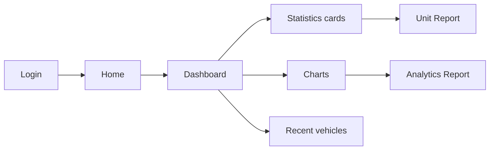

# Dashboard

The **Dashboard** (`/dashboard`) gives a high-level overview of inventory, expenses, and staff counts with interactive charts.

## Access

- **URL:** `/dashboard`
- **Permission:** `dashboard` → **view**
- **From Home:** click **go to dashboard** in the welcome line

## Dashboard flow

## Statistics cards

| Card | Data shown |
|------|------------|
| **Total Vehicles** | Count of all units in inventory |
| **Available** | Units ready for sale |
| **Reserved** | Units with active reservations |
| **Released** | Sold / released units |
| **Under Maintenance** | Units being serviced |
| **Forfeited** | Forfeited units |
| **Total Expenses** | Sum of all expense line items |
| **Purchase Value** | Total acquisition cost of fleet |
| **Employees** | Total and active employee count |
| **Sales Agents** | Total and active agent count |

## Charts

| Chart | Description |
|-------|-------------|
| **Monthly Vehicle Additions** | Line chart — new units added per month (last 6 months) |
| **Vehicle Status Distribution** | Pie chart — breakdown by status |
| **Top Makes** | Bar chart — most common vehicle makes |
| **Monthly Expenses** | Line chart — expense totals per month |

## Recent vehicles

A table of the **5 most recently added** units with quick links to view details.

## Related modules

- [Unit Report](../modules/car-reports/unit-report) — full inventory list
- [Analytics Report](../modules/analytics-report/) — detailed financial and sales reports
- [Expenses Report](../modules/payments-expenses/) — expense transactions
