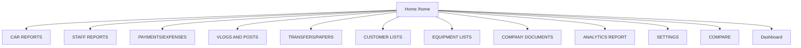

# Home Screen

After login, **Home** (`/home`) is the main navigation hub. It displays the same category cards you see in the application — each card opens a group of related modules.

## Access

- **URL:** `/home`
- **Permission:** `home` → **view**
- **Link from Home:** "go to dashboard" in the welcome text

## What you see

- **Welcome message** with your name and role
- **Category cards** — one per business area (only categories you have permission to view)
- **Logout** button at the bottom
- **Team Chat** widget (bottom-right, on all authenticated pages)

## All Home categories

| Category | Description | Documentation |
|----------|-------------|---------------|
| **CAR REPORTS** | Unit reports, photos, pricelist | [Car Reports](../modules/car-reports/) |
| **STAFF REPORTS** | Trackers and recommendations | [Staff Reports](../modules/staff-reports/) |
| **PAYMENTS/EXPENSES REPORTS** | Expenses, SOA, payroll, commission | [Payments & Expenses](../modules/payments-expenses/) |
| **VLOGS AND POSTS REPORTS** | Video and posting trackers | [Vlogs & Posts](../modules/vlogs-posts/) |
| **TRANSFERS/PAPERS REPORTS** | Documents and transfer OR/CR | [Transfers & Papers](../modules/transfers-papers/) |
| **CUSTOMER LISTS** | Client and trail form lists | [Customer Lists](../modules/customer-lists/) |
| **EQUIPMENT LISTS** | Mechanic tools and expenses | [Equipment Lists](../modules/equipment-lists/) |
| **COMPANY DOCUMENTS** | Employees, contracts, memos, BOLO | [Company Documents](../modules/company-documents/) |
| **ANALYTICS REPORT** | Financial and sales analytics | [Analytics Report](../modules/analytics-report/) |
| **SETTINGS** | System and application settings | [Settings](../modules/settings/) |
| **COMPARE** | Compare listings across competitor sites | [Compare](../modules/compare/) |

:::note
If a category card is **hidden**, your account does not have **view** permission for any module inside that group. Ask an admin to update your permissions.
:::

## Theme

Home supports **dark** and **light** themes. Your preference is saved in the browser (`localStorage`).
