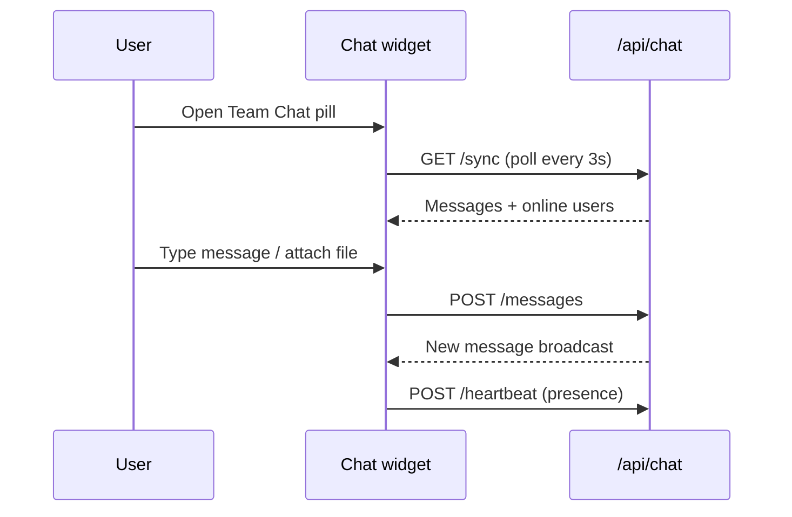

# Team Chat

**Team Chat** is a live messaging widget available on every authenticated page (including Home and Dashboard). It appears as a floating **Team Chat** pill in the bottom-right corner.

## Access

- **Availability:** All logged-in users (no separate page permission)
- **Widget location:** Bottom-right of any authenticated screen
- **API routes:** `/api/chat/sync`, `/api/chat/messages`, `/api/chat/heartbeat`

## Chat flow

## Using Team Chat

### Open and minimize

1. Click the **Team Chat** pill (shows your initials and unread badge)
2. The chat panel expands with message history and online users
3. Click the chevron to **minimize** back to the pill

### Send a message

1. Type in the **Type a message…** field (max 5,000 characters)
2. Press **Send** or click the paper-plane button

### Attach a file

1. Click the **paperclip** icon
2. Choose a file: images, PDF, Word, Excel, text, or ZIP (max 10 MB)
3. Send the message

### Share a link

1. Click the **link** icon
2. Enter a URL to share with the team

## Online presence

- The header shows **Live · N online**
- An online bar lists team members currently active
- Presence updates via heartbeat (users considered online for ~2 minutes after last activity)

## Notifications

The pill shows a **red badge** with the count of unread messages while the chat is minimized.

## Technical notes

- Messages are stored in the `chat_messages` table
- Polling interval: approximately **3 seconds**
- See [API overview](../api/overview) for endpoint details in Scribe at `/docs`
