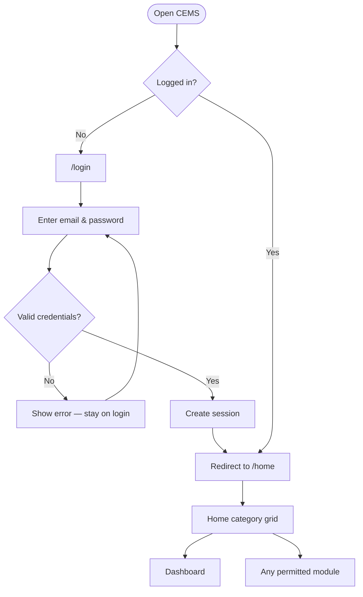

# Login & Logout

CEMS requires authentication for all business modules. Unauthenticated visitors are redirected to the login page.

## Access

| Action | URL |
|--------|-----|
| **Login** | `/login` |
| **Logout** | `/logout` (POST or GET while logged in) |
| **After login** | `/home` |

## Login flow

## Logging in

1. Open the application URL (e.g. `http://127.0.0.1:8000`)
2. You are redirected to **Login**
3. Enter your **email** and **password**
4. Click **Login**
5. On success you land on **Home** — the main module category grid

## Logging out

From **Home**, click **Logout** at the bottom of the page. You can also visit `/logout` while logged in.

Logout clears your session and returns you to the login screen. Your action is recorded in **User Activity Logs**.

## Roles

| Role | After login |
|------|-------------|
| **Admin** | Sees all Home categories and all module actions |
| **User** | Sees only categories and pages granted in **Permissions** |

See [Permissions](./permissions) for how admins assign module access.

## Next steps

- [Home screen](../core/home) — navigate to any module category
- [Dashboard](../core/dashboard) — summary charts and KPIs
- [Team Chat](../core/team-chat) — live messaging with colleagues
