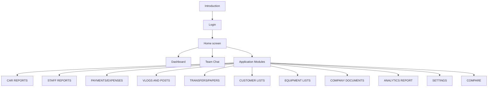

# Car Empire Management System (CEMS)

Welcome to the official documentation for **Car Empire Management System** — a Laravel-based platform for managing dealership operations: inventory, sales, expenses, payroll, contracts, analytics, and more.

## Who is this for?

| Audience | Start here |
|----------|------------|
| **Staff / end users** | [Login](./getting-started/login) → [Home](./core/home) → pick your module |
| **Administrators** | [Permissions](./getting-started/permissions) — roles and page access |
| **Developers** | [Installation](./getting-started/installation) and [API Reference](./api/overview) |

## Documentation map

## Core features (after login)

| Feature | Documentation |
|---------|---------------|
| **Login & Logout** | [Login guide](./getting-started/login) |
| **Home** | [Home screen](./core/home) — category grid matching the app |
| **Dashboard** | [Dashboard](./core/dashboard) — charts and KPIs |
| **Team Chat** | [Team Chat](./core/team-chat) — live messaging widget |

## All application modules

Every category on the Home screen is documented under **[Application Modules](./modules/car-reports/)**:

1. [CAR REPORTS](./modules/car-reports/) — Unit Report, Pricelist, Car Photos
2. [STAFF REPORTS](./modules/staff-reports/) — Trackers, agents
3. [PAYMENTS/EXPENSES REPORTS](./modules/payments-expenses/) — SOA, expenses, payroll
4. [VLOGS AND POSTS REPORTS](./modules/vlogs-posts/) — Video boost, posting tracker
5. [TRANSFERS/PAPERS REPORTS](./modules/transfers-papers/) — OR/CR, registration
6. [CUSTOMER LISTS](./modules/customer-lists/) — Follow-ups, appointments
7. [EQUIPMENT LISTS](./modules/equipment-lists/) — Mechanic tools
8. [COMPANY DOCUMENTS](./modules/company-documents/) — Employees, contracts, BOLO
9. [ANALYTICS REPORT](./modules/analytics-report/) — Financial & sales reports
10. [SETTINGS](./modules/settings/) — Users, branches, activity logs
11. [COMPARE](./modules/compare/) — Competitor listing comparison

→ Full overview with flowcharts: [System Features](./system-features)

## Technology stack

| Layer | Technology |
|-------|------------|
| Backend | Laravel 10, PHP 8.1+ |
| Database | MySQL / MariaDB |
| Frontend | Bootstrap 5, Blade, Font Awesome, SweetAlert2 |
| PDF | DomPDF |
| API docs | [Scribe](https://scribe.knuckles.wtf) at `/docs` on the running app |

## Quick links

- **Feature docs:** `{APP_URL}/documentation/docs/intro` — run `composer docs:build` first
- **API endpoints:** [API overview](./api/overview) → Scribe at `{APP_URL}/docs` (requires login)
- **Run locally:** [Installation guide](./getting-started/installation)
- **Offline ZIP / PDF:** [Offline & PDF export](./getting-started/offline-and-pdf)

---

*Documentation lives in the `documentation/` folder and is built with [Docusaurus](https://docusaurus.io).*
