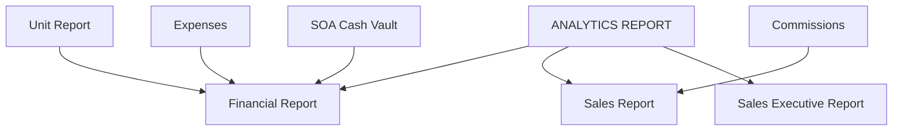

# ANALYTICS REPORT

**ANALYTICS REPORT** provides management dashboards for financial performance and sales metrics.

## Modules in this category

| Module | URL | Permission | Description |
|--------|-----|------------|-------------|
| **FINANCIAL REPORT** | `/analytics-report/financial` | `analytics` | Revenue, expenses, margins; export |
| **SALES REPORT** | `/analytics-report/sales` | `analytics` | Sales volume and performance |
| **SALES EXECUTIVE REPORT** | `/analytics-report/sales-executive` | `analytics` | Executive-level sales breakdown |

Additional hub: `/analytics` (analytics landing page).

## Financial Report

Comprehensive financial overview across the business.

- Income from sold/released units
- Expense totals and categories
- Status count badges for inventory breakdown
- **Export** financial data for spreadsheets

## Sales Report

Sales performance for **released units**:

- Summary: units released, total sales, average sold price, average days to sell
- Charts: monthly units, monthly sales amount, top makes/models, body type mix, fastest-selling models (avg days to sell)
- Tables: top makes/models, fastest models, monthly breakdown
- Filters: period (daily / weekly / monthly / quarterly / annually / custom range)
- **Export PDF** of the current filtered report (summary, charts, tables)

URL: `/analytics-report/sales`

## Sales Executive Report

Higher-level view of **who** is driving released-unit sales:

- Rankings for **Sales Team** (credited names from reservation/release), **Sales Agents**, and **Sales Executives**
- Charts: top by units, top by sales amount, monthly trend for the #1 performer
- Tables: full ranking with unit/sales share and average sale, plus recent deals
- Filters: view mode + period / custom date range

Credit order per released unit: sales person (reserved) → sales person (release) → sales agent name.

URL: `/analytics-report/sales-executive`

## Data sources

Analytics aggregates data from:

- [Unit Report](../car-reports/unit-report) — sold prices, status counts
- [Payments/Expenses](../payments-expenses/) — expense transactions, SOA
- [Staff Reports](../staff-reports/) — agent data

## Permissions

| Page key | Actions |
|----------|---------|
| `analytics` | view |

All three reports share the `analytics` permission.

## Related

- [Dashboard](../../core/dashboard) — summary charts (lighter overview)
- [System Features](../../system-features) — end-to-end workflow diagram
