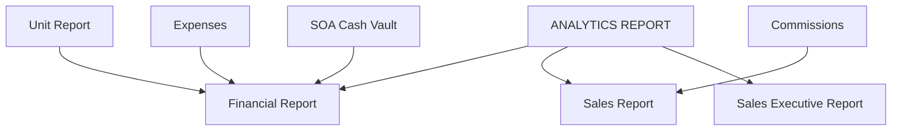

# ANALYTICS REPORT

**ANALYTICS REPORT** provides management dashboards for financial performance and sales metrics.

## Modules in this category

| Module | URL | Permission | Description |
|--------|-----|------------|-------------|
| **FINANCIAL REPORT** | `/analytics-report/financial` | `analytics` | Revenue, expenses, margins; export |
| **SALES REPORT** | `/analytics-report/sales` | `analytics` | Sales volume and performance |
| **SALES EXECUTIVE REPORT** | `/analytics-report/sales-executive` | `analytics` | Executive-level sales breakdown |

Additional hub: `/analytics` (analytics landing page).

## Financial Report

Comprehensive financial overview across the business.

- Income from sold/released units
- Expense totals and categories
- Status count badges for inventory breakdown
- **Export** financial data for spreadsheets

## Sales Report

Sales performance metrics — units sold, trends, and agent contribution.

## Sales Executive Report

Higher-level view for executive agents and management.

- Filter by executive agent
- Compare performance across the executive team

## Data sources

Analytics aggregates data from:

- [Unit Report](../car-reports/unit-report) — sold prices, status counts
- [Payments/Expenses](../payments-expenses/) — expense transactions, SOA
- [Staff Reports](../staff-reports/) — agent data

## Permissions

| Page key | Actions |
|----------|---------|
| `analytics` | view |

All three reports share the `analytics` permission.

## Related

- [Dashboard](../../core/dashboard) — summary charts (lighter overview)
- [System Features](../../system-features) — end-to-end workflow diagram
