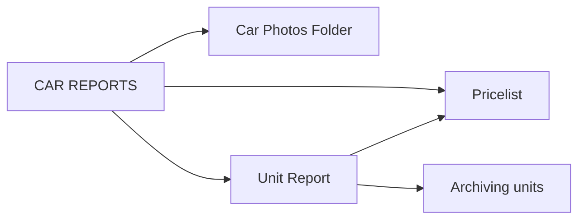
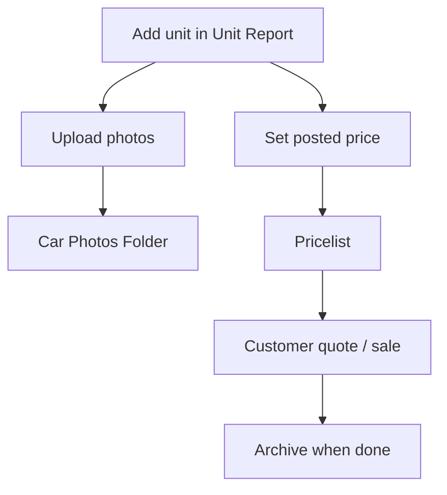

# CAR REPORTS

**CAR REPORTS** covers vehicle inventory, photos, and customer-facing pricing. Open this category from **Home** to access three modules.

## Modules in this category

| Module | URL | Permission | Guide |
|--------|-----|------------|-------|
| **CAR PHOTOS FOLDER** | `/car-photos-folder` | `car-photos-folder` → view | [Below](#car-photos-folder) |
| **UNIT REPORT** | `/vehicles` | `vehicles` → view | [Unit Report](./unit-report) |
| **PRICELIST** | `/pricelist` | `pricelist` → view | [Pricelist](./pricelist) |

---

## CAR PHOTOS FOLDER

Browse and manage vehicle images across the fleet from a single gallery view.

- **URL:** `/car-photos-folder`
- **Permission:** `car-photos-folder` → **view**
- **Features:** View photos by vehicle; quick navigation to unit records

---

## UNIT REPORT

Central inventory for all vehicles — status tabs, filters, exports, and full detail pages.

→ See the full guide: **[Unit Report](./unit-report)**

Key capabilities:
- Status tabs: Available, Reserved, Released, Forfeited, Under Maintenance, Archived
- Vehicle detail: expenses, documents, images, ads, custom fields
- Export filtered list as CSV or PDF

→ **[Archiving units](./unit-report-archiving)** — move older units out of active inventory

---

## PRICELIST

Pricing and financing options across active inventory.

→ See the full guide: **[Pricelist](./pricelist)**

Key capabilities:
- Posted price, sold price, financing plans
- Bulk financing updates and PDF export

---

## Typical workflow

