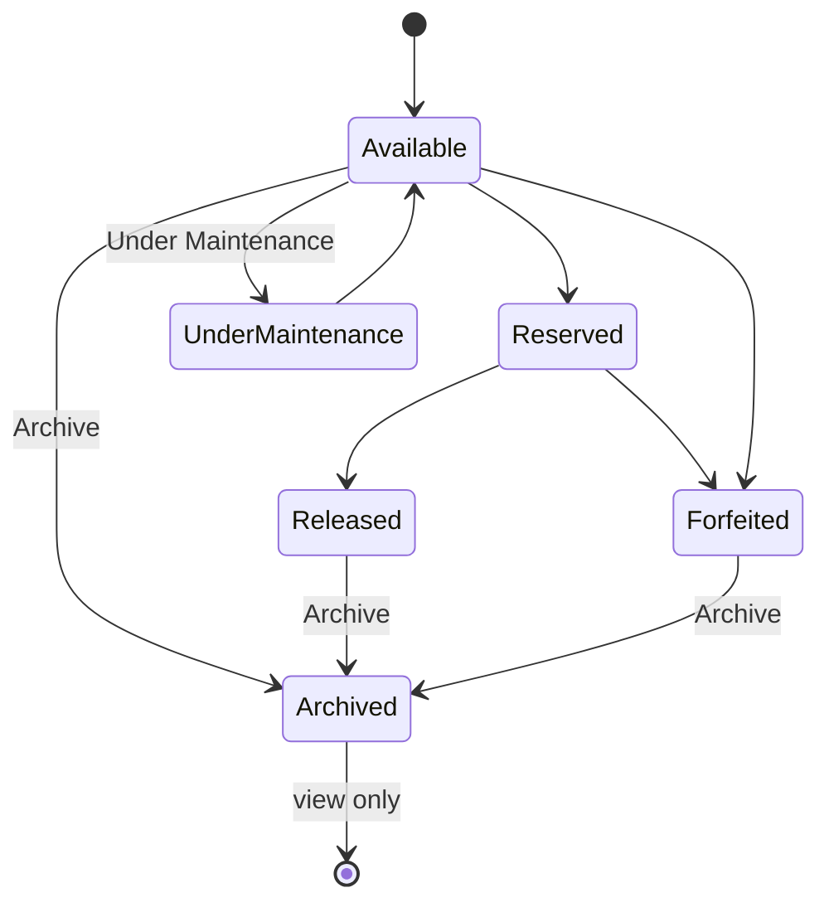

# Unit Report

The **Unit Report** (`/vehicles`) is the central inventory view for all vehicles in Car Empire. It shows acquisition details, status, pricing, and quick actions for each unit.

## Access

- **Home category:** CAR REPORTS → **UNIT REPORT**
- **URL:** `/vehicles`
- **Permission:** `vehicles` → **view** (minimum)
- **Archive / edit actions:** `vehicles` → **update**

## Status tabs

Units are organized by status tabs at the top of the list:

| Tab | Description |
|-----|-------------|
| **Available** | Units ready for sale |
| **Reserved** | Units with an active reservation |
| **Released** | Units that have been released/sold |
| **Forfeited** | Units marked as forfeited (includes units with forfeit details) |
| **Under Maintenance** | Units being serviced or prepared |
| **Archived** | Older units moved out of active inventory |
| **All Units** | All non-archived units combined |

:::important
**Archived units only appear on the Archived tab.** They are hidden from Available, Reserved, Released, Forfeited, and All Units.
:::

## Filters

Click **Search & filters** to expand the filter panel (collapsed by default):

- Text search (make, model, variant, plate)
- Status, year range, transmission, fuel type, body type
- Purchased from, reservation date

Active filters show as badges when the panel is collapsed.

## Vehicle list columns

| Column | Content |
|--------|---------|
| Vehicle | Thumbnail, full name, transmission & fuel |
| Year / Make / Model | Basic identification |
| Plate Number | Registration plate |
| Colour | Exterior colour |
| Purchase Price | Acquisition cost |
| Status | Current lifecycle status |
| Actions | View Details, Archive (where allowed) |

## Export

From the Unit Report header you can export the **current filtered list** as CSV or PDF via **Export List**.

## Vehicle detail page

Click **View Details** to open the full acquisition record for a unit, including:

- Posted price, sold price, incentives
- Expenses, documents, images, ads
- Status details (reservation, release, showroom)
- Custom sections and gas expenses
- Export to PDF or CSV

## Related modules

- **[Pricelist](./pricelist)** — pricing and financing options across inventory
- **[Archiving units](./unit-report-archiving)** — move older units to Archived

## Vehicle lifecycle

:::note
Reserved and Under Maintenance units **cannot** be archived directly. Change status first if an older unit needs to be archived.
:::
