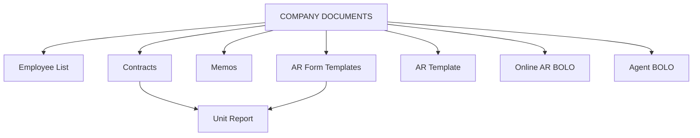

# COMPANY DOCUMENTS

**COMPANY DOCUMENTS** stores internal HR, legal, and administrative records — employees, contracts, memorandums, AR forms, and BOLO files.

## Modules in this category

| Module | URL | Permission | Description |
|--------|-----|------------|-------------|
| **EMPLOYEE LIST** | `/employees` | `employees` | HR employee master list |
| **CONTRACTS** | `/contracts` | `contracts` | Sales contracts linked to vehicles |
| **MEMOS** | `/memos` | `memos` | Text memos with file uploads and links |
| **AR FORM TEMPLATES** | `/document-templates` | `document-templates` | Reusable AR document form templates |
| **AR TEMPLATE** | `/ar-template` | `ar-template` | Company AR template files or links |
| **ONLINE AR BOLO** | `/online-ar-bolo` | `online-ar-bolo` | Online AR BOLO document storage |
| **AGENT BOLO** | `/agent-bolo` | `agent-bolo` | Per-agent BOLO files and links |

## Employee List

Maintain company employee records.

- Name, position, status (active/inactive), contact details
- Full CRUD for HR administrators

## Contracts

Sales contracts tied to vehicles and clients.

- Search and link vehicles when creating contracts
- Store contract terms, dates, and parties
- View, edit, and delete contract records

## Memos

Dedicated memo board for internal notes.

- **URL:** `/memos`
- Add memo **text**, **upload a file**, or **attach a link** (at least one required)
- Edit and delete memos from card view

## AR Form Templates

Create and manage reusable document form templates used when generating vehicle paperwork.

- Template builder with fields
- Used by Unit Report document generation

## AR Template

Upload or link company-standard AR template files.

## Online AR BOLO

Store Online AR BOLO documents — upload files or attach external links.

## Agent BOLO

Per sales agent BOLO (Be On the Lookout) records.

- Agent profile with attached documents
- Add/remove files and links per agent

## Permissions

Each module has its own page key (`employees`, `contracts`, `memos`, `document-templates`, `ar-template`, `online-ar-bolo`, `agent-bolo`, `admin-docs`).
