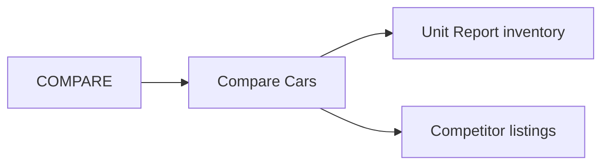

# COMPARE

**COMPARE** lets staff compare Car Empire listings against competitor websites to stay competitive on pricing and inventory.

## Modules in this category

| Module | URL | Permission | Description |
|--------|-----|------------|-------------|
| **COMPARE CARS** | `/compare` | `dashboard` | Side-by-side listing comparison tool |

## Compare Cars

Open from **Home** → **COMPARE** → **COMPARE CARS**.

- View Car Empire units alongside competitor listings
- Compare pricing and specifications across sites
- Support pricing decisions for [Pricelist](../car-reports/pricelist) updates

## Access

- **URL:** `/compare`
- Uses authenticated session (same as dashboard-level access)

## Related modules

- [Unit Report](../car-reports/unit-report) — your inventory source
- [Pricelist](../car-reports/pricelist) — apply competitive pricing adjustments
