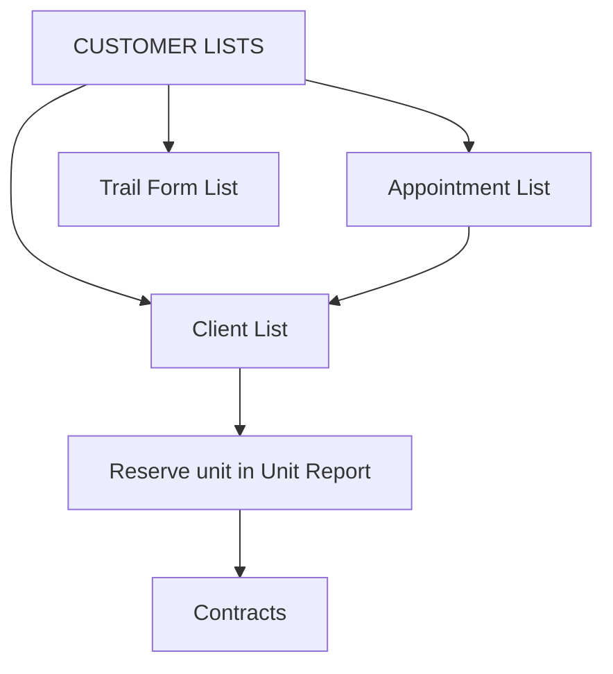

# CUSTOMER LISTS

**CUSTOMER LISTS** manages client relationships — follow-ups, scheduled appointments, and trail form references.

## Modules in this category

| Module | URL | Permission | Description |
|--------|-----|------------|-------------|
| **CLIENT LIST** | `/client-follow-up-list` | `client-follow-up-list` | Track client contacts and follow-up status |
| **APPOINTMENT LIST** | `/appointment-list` | `appointment-list` | Scheduled client appointments |
| **TRAIL FORM LIST** | `/trail-form-list` | `trail-form-list` | Client inquiries and reservations |

## Client List

CRM-style list for tracking client interactions.

- Add clients with contact details and follow-up notes
- Update status as conversations progress
- Full CRUD — create, view, edit, delete entries

## Appointment List

Schedule and manage client appointments (showroom visits, test drives, document signing).

- Create appointments with date, time, and client info
- Edit and cancel appointments
- View appointment history

## Trail Form List

Track client **inquiries** and **reservations** with inquiry source and vehicle interest.

- **URL:** `/trail-form-list`
- **Add Client** — name, contact, status (Inquiring / Reservation), where they inquired, vehicle type, unit details, notes
- Filter by status, inquiry source, or search text
- Edit and delete records from the table

## Sales workflow

1. **Appointment List** — client schedules visit
2. **Client List** — log calls and next steps
3. **Unit Report** — reserve vehicle when client commits
4. **Contracts** — formalize sale (see [Company Documents](../company-documents/))

## Permissions

| Page key | Actions |
|----------|---------|
| `client-follow-up-list` | view, create, update, delete |
| `appointment-list` | view, create, update, delete |
| `admin-docs` | view |
