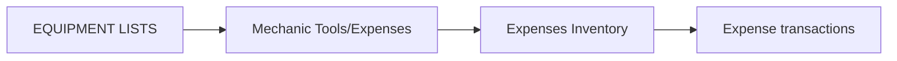

# EQUIPMENT LISTS

**EQUIPMENT LISTS** tracks mechanic tools and related equipment purchases.

## Modules in this category

| Module | URL | Permission | Description |
|--------|-----|------------|-------------|
| **MECHANIC TOOLS/EXPENSES** | `/mechanic-tools-expenses` | `expenses-inventory` | Tool purchases and mechanic expenses |

:::note
`/mechanic-tools-expenses` redirects to `/expenses-inventory?section=tools-purchase` — the tools section inside Expenses Report.
:::

## Mechanic Tools / Expenses

Manage shop tools and equipment spending.

- **Add tools** — record new tool purchases with cost and date
- **Tool history** — view usage and purchase history per tool
- **Search tools** — find tools by name or category
- Link expenses to the broader [Payments/Expenses](../payments-expenses/) reporting

## Related modules

- [Staff Reports](../staff-reports/) — Mechanic Tracker and Driver Activity Tracker use the same tools section
- [Expenses Report](../payments-expenses/) — parent module for all expense data

## Permissions

| Page key | Actions |
|----------|---------|
| `expenses-inventory` | view, create, update, delete |
