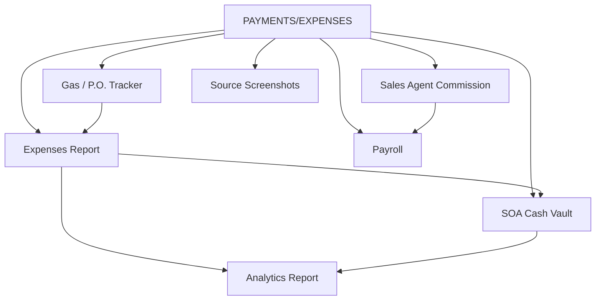

# PAYMENTS/EXPENSES REPORTS

**PAYMENTS/EXPENSES REPORTS** handles all money flowing in and out of operations — daily cash, expenses, commissions, and payroll.

## Modules in this category

| Module | URL | Permission | Description |
|--------|-----|------------|-------------|
| **EXPENSES REPORT** | `/expenses-inventory` | `expenses-inventory` | Master expense inventory and tools section |
| **SOA CASH VAULT** | `/soa/create` | `soa` | Daily Statement of Account / cash vault |
| **SALES AGENT COMMISSION** | `/sales-agent-commissions` | `sales-agent-commissions` | Commission records per agent |
| **GAS EXPENSES/P.O. TRACKER** | `/gas-expense-po-tracker` | `gas-expense-po-tracker` | Gas expenses and purchase orders |
| **PAYROLL** | `/payroll` | `payroll` | Payroll reporting |
| **SOURCE SCREENSHOTS** | `/source-screenshots` | `source-screenshots` | Proof screenshots for transactions |

## Expenses Report

Central hub for expense transactions and inventory tools.

- View all expense transactions with filters
- Create transactions with line items and receipt uploads
- **Tools purchase** section for mechanic equipment
- Export inventory to CSV

**Expense detail** (`/expenses/{id}`): add items, attach receipts, link to vehicles.

## SOA Cash Vault

Daily cash management — starting balance, cash additions, manual entries, floated funds.

- Select a date to view or create the daily SOA
- Track inflows and outflows against the cash vault
- API endpoints for real-time updates on the SOA page

## Sales Agent Commission

Record and manage commissions owed to sales agents. Links to agent profiles from [Staff Reports](../staff-reports/).

## Gas Expenses / P.O. Tracker

- Create and manage **purchase orders**
- Log **gas expenses** per vehicle or operation
- Export summary to PDF

## Payroll

Payroll reporting module for staff compensation records.

## Source Screenshots

Upload and store screenshot proof for financial transactions (bank transfers, payment confirmations, etc.).

## Permissions

| Page key | Typical actions |
|----------|-----------------|
| `expenses-inventory` | view, create, update, delete |
| `expenses` | view, create, update, delete (transaction detail) |
| `soa` | view, create, update |
| `sales-agent-commissions` | view, create, update, delete |
| `gas-expense-po-tracker` | view, create, update, delete |
| `payroll` | view |
| `source-screenshots` | view, create, update, delete |
