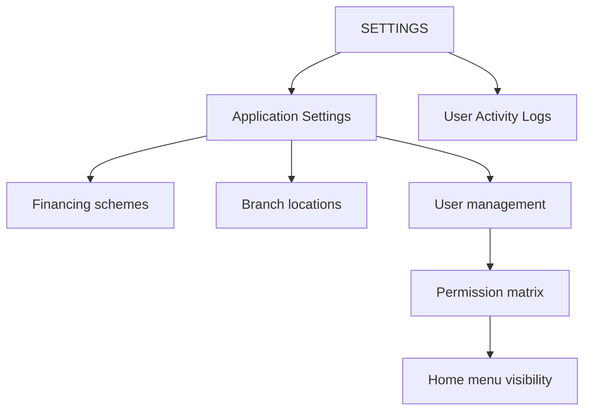

# SETTINGS

**SETTINGS** covers system configuration, user management (admins), branch locations, financing schemes, and audit logs.

## Modules in this category

| Module | URL | Permission | Description |
|--------|-----|------------|-------------|
| **APPLICATION SETTINGS** | `/settings` | `settings` | System configuration hub |
| **USER ACTIVITY LOGS** | `/admin-docs` | `admin-docs` | Audit trail of all user actions |

Additional settings pages (from Settings hub):

| Page | URL | Permission |
|------|-----|------------|
| **Car Price List / Financing** | `/settings/financing` | `settings.financing` |
| **Branch / Location** | `/settings/branch-locations` | `settings.branch-locations` |
| **User management** | `/settings/users` | Admin only |

## Application Settings

Central settings page with links to:

- Financing configuration (schemes used by Pricelist)
- Branch / location master data
- User management (admin only)

## User management (Admin only)

Admins can:

1. **Create users** — name, email, password, role
2. **Edit users** — update profile and role
3. **Assign permissions** — per-page view / create / update / delete matrix
4. **Delete users** — remove accounts

Permission groups mirror Home categories. See [Permissions](../../getting-started/permissions).

## Car Price List / Financing

Configure financing schemes and default rates applied in [Pricelist](../car-reports/pricelist).

## Branch / Location

Manage dealership branch locations used across the system.

## User Activity Logs

Complete audit trail:

- Login and logout events
- Page views and data changes (via activity middleware)
- Filter by user, action, date, and model type

## Permissions

| Page key | Who |
|----------|-----|
| `settings` | Users with settings access |
| `settings.financing` | Financing admins |
| `settings.branch-locations` | Branch admins |
| User management | **Admin role only** |
| `admin-docs` | Users with activity log view permission |
