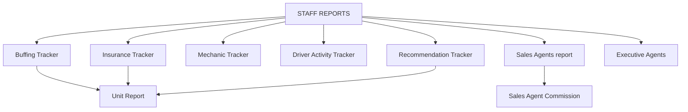

# STAFF REPORTS

**STAFF REPORTS** tracks staff activity, vehicle service work, and agent performance. Open from **Home** → **STAFF REPORTS**.

## Modules in this category

| Module | URL | Permission | Description |
|--------|-----|------------|-------------|
| **BUFFING TRACKER** | `/buffing-tracker` | `buffing-tracker` | Track buffing/detailing jobs per vehicle |
| **INSURANCE TRACKER** | `/insurance-tracker` | `insurance-tracker` | Monitor insurance processing status |
| **MECHANIC TRACKER** | `/expenses-inventory?section=tools-purchase` | `expenses-inventory` | Mechanic work linked to tools/expenses |
| **DRIVER ACTIVITY TRACKER** | `/expenses-inventory?section=tools-purchase` | `expenses-inventory` | Driver activity records |
| **RECOMMENDATION TRACKER** | `/recommendation-tracker` | `recommendation-tracker` | Vehicle recommendations with photo attachments |
| **SALES AGENTS** | `/staff-reports/sales-agents` | `staff-reports.sales-agents` | Staff report view for sales agents |
| **EXECUTIVE AGENTS** | `/staff-reports/executive-agents` | `staff-reports.executive-agents` | Executive agent records and reporting |

## Buffing Tracker

Record and follow up buffing/detailing work on inventory units.

- Create, edit, and view buffing entries
- Link entries to vehicles and staff

## Insurance Tracker

Track insurance applications and completion status per unit or client.

## Mechanic & Driver Activity Trackers

Both route to the **Expenses Inventory** tools section. Used for mechanic tool purchases and driver-related activity logging.

→ Also see [Equipment Lists](../equipment-lists/)

## Recommendation Tracker

Log vehicle recommendations (e.g. from inspections) with optional image uploads.

## Sales Agents & Executive Agents

- **Sales Agents** — performance/reporting view for the sales team
- **Executive Agents** — manage and report on executive-level agents
- Agent master data: `/sales-agents` (CRUD for agent profiles)

## Permissions

Each module uses its own page key. Grant **view / create / update / delete** per user in **Settings → Users → Permissions**.
