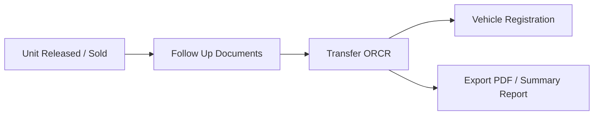

# TRANSFERS/PAPERS REPORTS

**TRANSFERS/PAPERS REPORTS** manages post-sale paperwork — document follow-ups, OR/CR transfers, and LTO registration tracking.

## Modules in this category

| Module | URL | Permission | Description |
|--------|-----|------------|-------------|
| **FOLLOW UP DOCUMENTS** | `/follow-up-documents` | `follow-up-documents` | Track pending documents after sale |
| **TRANSFER ORCR** | `/transfer-orcr` | `transfer-orcr` | OR/CR transfer records and fees |
| **VEHICLE REGISTRATION** | `/vehicle-registration` | `vehicle-registration` | Registration status and details |

## Follow Up Documents

Track documents still needed from clients or third parties after a sale.

- Create follow-up entries with due dates and status
- Mark complete when documents are received
- Full CRUD on all records

## Transfer OR/CR

Manage Official Receipt and Certificate of Registration transfers.

- Record transfer details, fees, and parties
- **Summary report** for batch overview
- **Export to PDF** for printing or filing
- Fee fields for LTO, encoding, and related charges

## Vehicle Registration

Track vehicle registration progress with LTO.

- Registration status per unit
- Create and update registration records
- Link to sold/released units

## Typical post-sale flow

1. Client purchases unit → status **Released** in Unit Report
2. Open **Follow Up Documents** for missing papers
3. Process **Transfer OR/CR** with fee breakdown
4. Complete **Vehicle Registration** when LTO is done

## Permissions

| Page key | Actions |
|----------|---------|
| `follow-up-documents` | view, create, update, delete |
| `transfer-orcr` | view, create, update, delete |
| `vehicle-registration` | view, create, update, delete |
