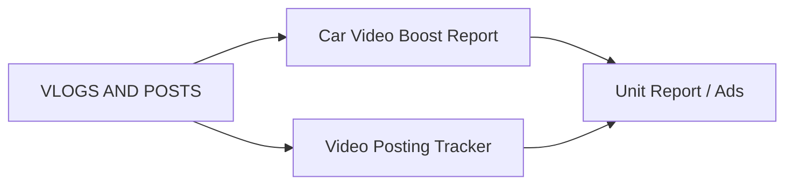

# VLOGS AND POSTS REPORTS

**VLOGS AND POSTS REPORTS** tracks marketing content — paid video boosts and social media posting activity for inventory units.

## Modules in this category

| Module | URL | Permission | Description |
|--------|-----|------------|-------------|
| **CAR VIDEO BOOST REPORT** | `/car-video-boost-report` | `car-video-boost-report` | Manage paid ad/boost entries for vehicle videos |
| **VIDEO AND POSTING TRACKER** | `/video-posting-tracker` | `video-posting-tracker` | Track video posts and social content per unit |

## Car Video Boost Report

Track advertising spend and boost campaigns for vehicle video content.

- View all boost/ad entries
- Add, edit, and remove ad records
- Link boosts to specific vehicles

## Video and Posting Tracker

Full CRUD tracker for video production and posting schedules.

- Create posting records per vehicle or campaign
- Edit and update posting status
- View history of posted content

## Workflow

1. Unit added to **Unit Report** with photos/video
2. Log boost spend in **Car Video Boost Report**
3. Track published posts in **Video Posting Tracker**
4. Review performance in **Analytics Report** (sales correlation)

## Permissions

| Page key | Actions |
|----------|---------|
| `car-video-boost-report` | view, create, update, delete |
| `video-posting-tracker` | view, create, update, delete |
