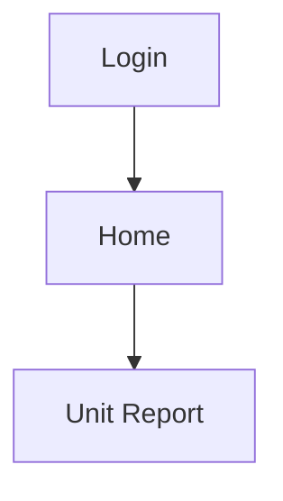
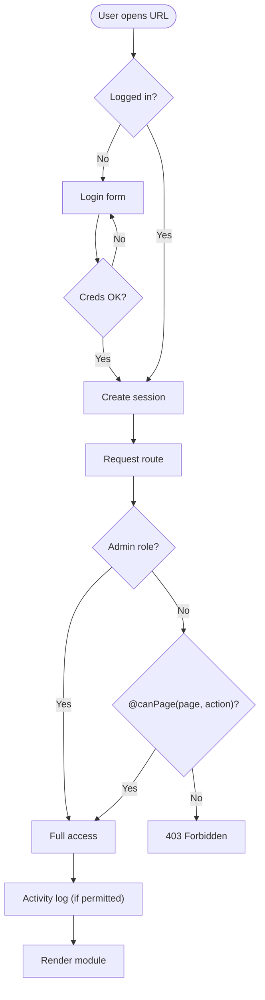
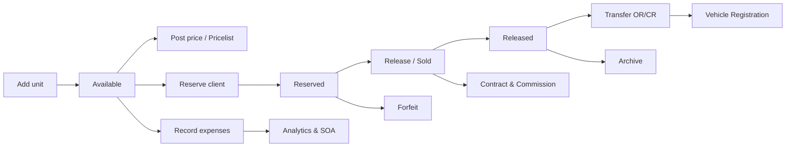
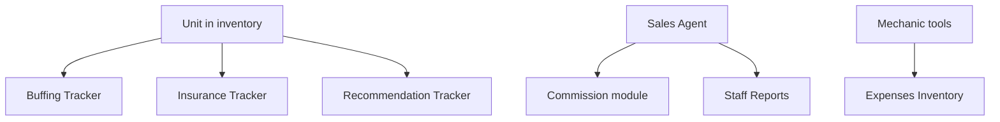
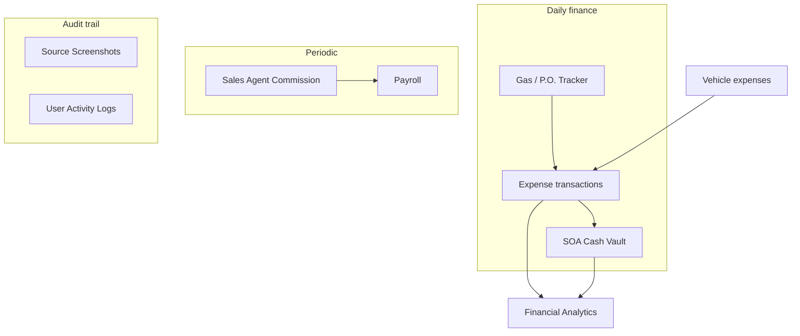
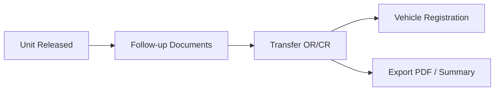
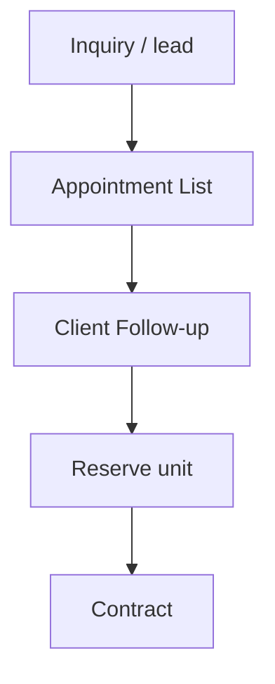
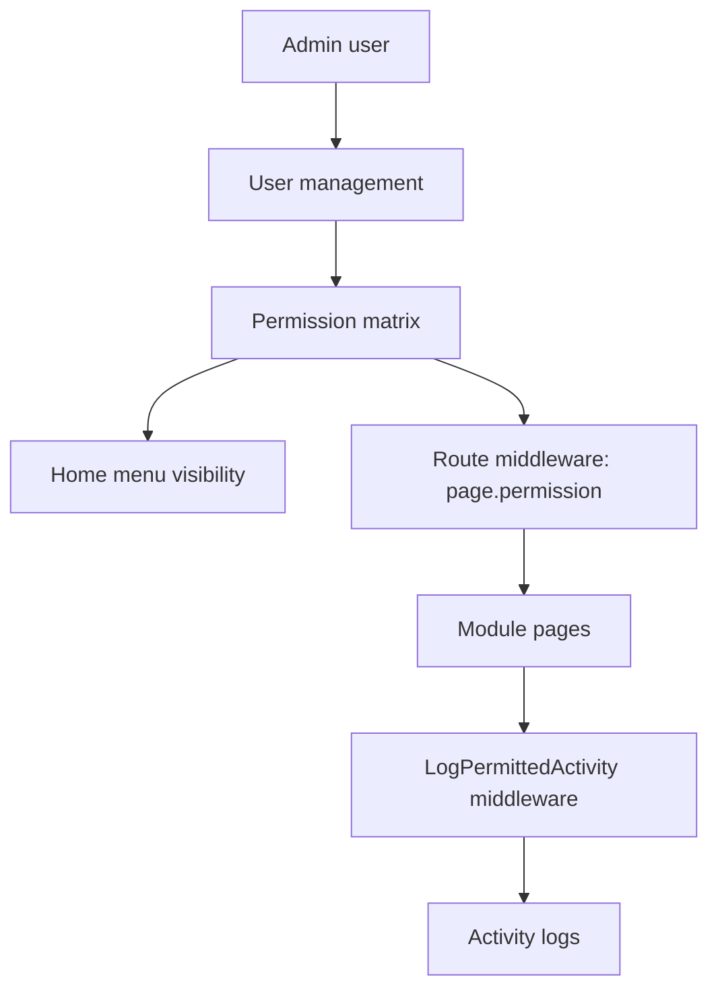
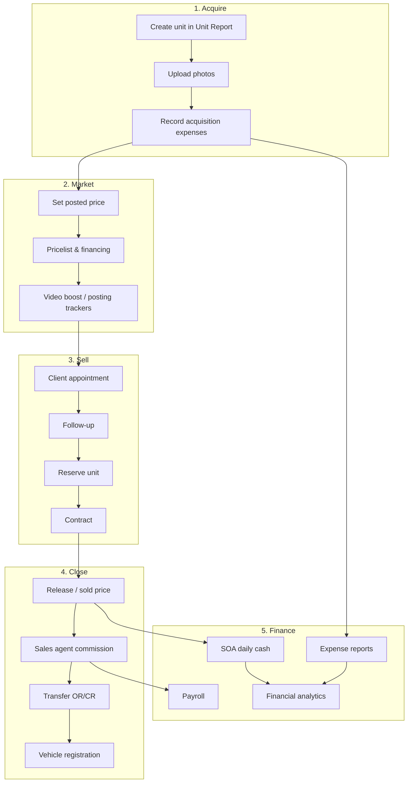

# System Features & Flowcharts

This page is the **master reference** for Car Empire Management System (CEMS). It maps every major module, how they connect, and the main business workflows.

## Documentation plugin: Mermaid

CEMS docs are built with **[Docusaurus](https://docusaurus.io)**. For flowcharts and diagrams we use **[Mermaid](https://mermaid.js.org)** via the official **`@docusaurus/theme-mermaid`** plugin.

| Option | Best for | Notes |
|--------|----------|-------|
| **Mermaid** (recommended) | Flowcharts, state diagrams, sequence diagrams | Native in Docusaurus; diagrams live in Markdown as code blocks |
| Draw.io / diagrams.net | Complex visual layouts | Export PNG/SVG and embed in docs |
| PlantUML | UML-heavy technical docs | Needs extra build step; less common in Docusaurus |

**How to add a diagram** — wrap Mermaid syntax in a fenced code block:

````markdown

````

Mermaid is enabled in `documentation/docusaurus.config.js`. Run the docs site locally:

```bash
cd documentation
npm start
```

Open **http://127.0.0.1:8000/documentation/docs/system-features** after running `npm run build:laravel` from this folder (see [documentation README](https://github.com/johnbalmacedadev-blip/CEMS/tree/main/documentation)).

For live editing preview only: `npm start` → http://localhost:3000/docs/system-features

---

## High-level system map

CEMS is a Laravel web application for dealership operations: inventory, sales, finance, staff tracking, documents, and analytics. After login, users land on **Home**, which groups modules by business area.

```mermaid
flowchart TB
    subgraph Access["Access layer"]
        Login["/login"]
        Auth["Session auth"]
        Perm["Page permissions"]
    end

    subgraph Core["Core pages"]
        Home["Home menu"]
        Dash["Dashboard"]
        Chat["Live team chat"]
    end

    subgraph Inventory["CAR REPORTS"]
        Photos["Car Photos Folder"]
        Units["Unit Report"]
        Price["Pricelist"]
    end

    subgraph Sales["Sales & customers"]
        Contract["Contracts"]
        Comm["Sales Agent Commission"]
        Follow["Client Follow-up"]
        Appt["Appointment List"]
    end

    subgraph Ops["Operations & papers"]
        Transfer["Transfer OR/CR"]
        Reg["Vehicle Registration"]
        Docs["Follow-up Documents"]
    end

    subgraph Finance["PAYMENTS / EXPENSES"]
        ExpInv["Expenses Report"]
        SOA["SOA Cash Vault"]
        Payroll["Payroll"]
        Gas["Gas / P.O. Tracker"]
    end

    subgraph Staff["STAFF REPORTS"]
        Buff["Buffing Tracker"]
        Ins["Insurance Tracker"]
        Rec["Recommendation Tracker"]
        Agents["Sales & Executive Agents"]
    end

    subgraph Media["VLOGS & POSTS"]
        Boost["Car Video Boost"]
        Video["Video Posting Tracker"]
    end

    subgraph Company["COMPANY DOCUMENTS"]
        Emp["Employee List"]
        Templates["AR Form Templates"]
        Bolo["BOLO modules"]
    end

    subgraph Insights["ANALYTICS"]
        Fin["Financial Report"]
        SalesR["Sales Reports"]
    end

    subgraph Admin["SETTINGS"]
        Settings["Application Settings"]
        Users["User management"]
        Logs["Activity logs"]
    end

    Login --> Auth --> Perm
    Auth --> Home
    Auth --> Dash
    Auth --> Chat
    Home --> Inventory
    Home --> Sales
    Home --> Ops
    Home --> Finance
    Home --> Staff
    Home --> Media
    Home --> Company
    Home --> Insights
    Home --> Admin
    Units --> Price
    Units --> ExpInv
    Units --> Contract
    Units --> Transfer
```



---

## Authentication & permissions flow

Every protected route requires login. **Admins** bypass page checks. **Users** need explicit **view / create / update / delete** rights per page.



| Role | User management | Module access |
|------|---------------|---------------|
| **Admin** | Create users, assign permissions | All pages and actions |
| **User** | None | Only granted page keys |

See [Permissions & roles](./getting-started/permissions) for assigning access.

---

## Home menu categories

The Home page (`/home`) mirrors permission groups. Categories are hidden when the user cannot view any item inside them.

| Category | Modules | Primary purpose |
|----------|---------|-----------------|
| **CAR REPORTS** | Car Photos Folder, Unit Report, Pricelist | Inventory, photos, customer-facing prices |
| **STAFF REPORTS** | Buffing, Insurance, Recommendation trackers; Sales & Executive Agents; Mechanic tools | Staff activity and service tracking |
| **PAYMENTS / EXPENSES** | Expenses Report, SOA, Commission, Gas/P.O., Payroll, Source Screenshots | Money in/out, payroll, proof of spend |
| **VLOGS AND POSTS** | Car Video Boost Report, Video Posting Tracker | Marketing and social content |
| **TRANSFERS / PAPERS** | Follow-up Documents, Transfer OR/CR, Vehicle Registration | Title transfer and registration paperwork |
| **CUSTOMER LISTS** | Client Follow-up, Appointment List, Trail Form | CRM-style client tracking |
| **EQUIPMENT LISTS** | Mechanic Tools/Expenses | Tool purchases linked to expenses inventory |
| **COMPANY DOCUMENTS** | Employees, Contracts, Memos, AR templates, BOLO | Internal HR and legal documents |
| **ANALYTICS REPORT** | Financial, Sales, Sales Executive reports | Management dashboards |
| **SETTINGS** | Application settings, User activity logs | System configuration and audit |
| **COMPARE** | Compare Cars | Cross-site listing comparison |

---

## Module feature reference

### CAR REPORTS

| Module | Route | Features |
|--------|-------|----------|
| **Unit Report** | `/vehicles` | Full vehicle lifecycle, status tabs, filters, export CSV/PDF, detail page with expenses, documents, images, ads, custom fields |
| **Pricelist** | `/pricelist` | Posted prices, financing schemes, bulk financing update, PDF export |
| **Car Photos Folder** | `/car-photos-folder` | Browse vehicle images across inventory |

**Vehicle acquisition → sale flow** (summary; full diagram in [Unit Report](./modules/car-reports/unit-report)):



Vehicle statuses: **Available**, **Reserved**, **Released**, **Forfeited**, **Under Maintenance**, **Archived**.

---

### STAFF REPORTS

| Module | Route | Features |
|--------|-------|----------|
| **Buffing Tracker** | `/buffing-tracker` | Track buffing jobs per vehicle/staff |
| **Insurance Tracker** | `/insurance-tracker` | Insurance processing status |
| **Recommendation Tracker** | `/recommendation-tracker` | Recommendations with image attachments |
| **Sales Agents** | `/staff-reports/sales-agents` | Staff report view for sales agents |
| **Executive Agents** | `/staff-reports/executive-agents` | Executive agent records |
| **Sales Agents (CRUD)** | `/sales-agents` | Maintain agent master list |
| **Mechanic / Tools** | `/expenses-inventory?section=tools-purchase` | Tool purchases and mechanic expenses |



---

### PAYMENTS / EXPENSES REPORTS

| Module | Route | Features |
|--------|-------|----------|
| **Expenses Report** | `/expenses-inventory` | Inventory of expense transactions, categories, receipts, tools section, CSV export |
| **Expense Transactions** | `/expenses/create`, `/expenses/{id}` | Line items, receipts, vehicle-linked categories |
| **SOA Cash Vault** | `/soa/create` | Daily cash statement, starting cash, additions, manual entries, floated funds |
| **Sales Agent Commission** | `/sales-agent-commissions` | Commission records linked to agents |
| **Gas Expenses / P.O. Tracker** | `/gas-expense-po-tracker` | Purchase orders and gas expenses, PDF export |
| **Payroll** | `/payroll` | Payroll reporting |
| **Source Screenshots** | `/source-screenshots` | Store proof screenshots for transactions |



---

### VLOGS AND POSTS REPORTS

| Module | Route | Features |
|--------|-------|----------|
| **Car Video Boost Report** | `/car-video-boost-report` | Manage vehicle ad/boost entries |
| **Video Posting Tracker** | `/video-posting-tracker` | Track video posts per unit/campaign |

---

### TRANSFERS / PAPERS REPORTS

| Module | Route | Features |
|--------|-------|----------|
| **Follow-up Documents** | `/follow-up-documents` | Track pending document follow-ups |
| **Transfer OR/CR** | `/transfer-orcr` | OR/CR transfer records, summary report, PDF export |
| **Vehicle Registration** | `/vehicle-registration` | Registration status and details |



---

### CUSTOMER LISTS

| Module | Route | Features |
|--------|-------|----------|
| **Client Follow-up List** | `/client-follow-up-list` | Client contact and follow-up status |
| **Appointment List** | `/appointment-list` | Scheduled client appointments |
| **Trail Form List** | `/admin-docs` | Activity / trail references |



---

### COMPANY DOCUMENTS

| Module | Route | Features |
|--------|-------|----------|
| **Employee List** | `/employees` | HR employee records |
| **Contracts** | `/contracts` | Sales contracts linked to vehicles |
| **AR Form Templates** | `/document-templates` | Reusable document form templates |
| **AR Template** | `/ar-template` | Company AR template files/links |
| **Online AR BOLO** | `/online-ar-bolo` | Online AR BOLO documents |
| **Agent BOLO** | `/agent-bolo` | Per-agent BOLO files and links |

---

### ANALYTICS REPORT

| Module | Route | Features |
|--------|-------|----------|
| **Financial Report** | `/analytics-report/financial` | Revenue, expenses, margins; export |
| **Sales Report** | `/analytics-report/sales` | Sales performance metrics |
| **Sales Executive Report** | `/analytics-report/sales-executive` | Executive-level sales view |
| **Analytics hub** | `/analytics` | Analytics landing |

Data is aggregated from Unit Report (sold prices, status), expenses, SOA, and related modules.

---

### SETTINGS & ADMINISTRATION

| Module | Route | Features |
|--------|-------|----------|
| **Application Settings** | `/settings` | System configuration hub |
| **Car Price List / Financing** | `/settings/financing` | Financing schemes used by Pricelist |
| **Branch / Location** | `/settings/branch-locations` | Branch master data |
| **User management** | `/settings/users` | Admins only: users CRUD |
| **Permissions** | `/settings/users/{id}/permissions` | Per-page view/create/update/delete matrix |
| **User Activity Logs** | `/admin-docs` | Audit trail of user actions |



---

### Other features

| Feature | Route / location | Description |
|---------|------------------|-------------|
| **Dashboard** | `/dashboard` | Summary dashboard after login |
| **Compare Cars** | `/compare` | Compare listings across competitor sites |
| **Live team chat** | Floating widget (all pages) | Real-time messages via `/api/chat/*` |
| **API documentation** | `{APP_URL}/docs` | Scribe-generated API reference |
| **PDF exports** | Various modules | DomPDF for pricelist, transfer OR/CR, gas tracker, vehicle exports |

---

## End-to-end dealership workflow

Typical path from acquiring a car to closing books:



---

## Permission page keys (quick index)

Full list is maintained in `config/pages.php`. Common keys:

| Page key | Label |
|----------|-------|
| `vehicles` | Unit Report |
| `pricelist` | Pricelist |
| `expenses` / `expenses-inventory` | Expenses |
| `soa` | SOA Cash Vault |
| `contracts` | Contracts |
| `transfer-orcr` | Transfer OR/CR |
| `analytics` | Analytics reports |
| `settings` | Settings |
| `payroll` | Payroll |
| `sales-agent-commissions` | Commission |

---

## Related documentation

- [Introduction](./intro) — stack and quick links
- [Login](./getting-started/login) — authentication flow
- [Home screen](./core/home) — all Home categories
- [Dashboard](./core/dashboard) — KPIs and charts
- [Team Chat](./core/team-chat) — live messaging
- [Permissions](./getting-started/permissions) — roles and `@canPage`
- [Unit Report](./modules/car-reports/unit-report) — vehicle lifecycle state diagram
- [API overview](./api/overview) — JSON endpoints and Scribe

---

*To extend this document: add a ` ```mermaid ` block under any module section, or create a dedicated page under `documentation/docs/modules/`.*
